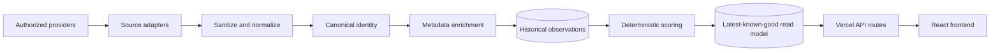
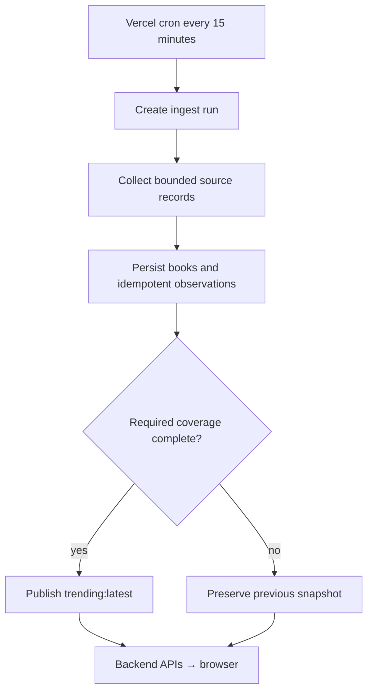

# BookPulse

**Trend intelligence for books, built around the Filipino reading pulse.**

BookPulse answers three practical questions: **what books are receiving attention, where is that attention coming from, and how has momentum changed across persisted observations?** It is not a review site, social network, bookshelf tracker, or generic recommendation engine.

> **Coverage note:** “Philippines-first” describes the communities BookPulse prioritizes. It does not mean that the data represents every reader in the Philippines. The scheduled collection cadence is 15 minutes, but provider latency, unavailable sources, and failed runs can make a published snapshot older.

## Product surfaces

- **Trending Now** serves the backend-published latest-known-good ranking.
- **Book history** exposes sparse, persisted source observations without manufactured gap points.
- **Book detail** explains score and rank movement, provenance, freshness, and insufficient history.
- **Breakout Radar** separates unusual recent momentum from established popularity.
- **Source Health** reports whether each provider is healthy, stale, failing, or unconfigured.
- **Methodology** explains signal semantics, score components, confidence, and limitations.

Screenshots are intentionally not embedded until they can be regenerated from a verified runnable build. This avoids presenting stale mock screens as implemented production behavior.

## Architecture





The backend is authoritative. Browser code reads BookPulse APIs only; provider tokens and the Supabase service-role key remain server-side.

## Source availability

| Source | Production state | Signal semantics | Geographic limitation |
| --- | --- | --- | --- |
| Reddit `r/phbookclub` | Implemented; OAuth configuration required | Each matched post produces an explicit cumulative `discussion_count` (comments), with stable post ID and provider creation time. | Community-specific attention, not a representative national sample. |
| TikTok | Not configured | No production signal. Research API fields would remain separate event/cumulative signal types. | Access and region interpretation require provider approval and validation. |
| Goodreads | Unavailable | No production signal. | Goodreads provides no supported new developer-key route for this use case. |
| Open Library | Metadata only | Cover and bibliographic enrichment—not a trend signal. | Catalog metadata has no Philippine trend meaning. |

BookPulse does not scrape an unsupported provider or silently substitute demo observations in production. See [`docs/source-feasibility.md`](docs/source-feasibility.md) for the dated provider assessment.

## Observation and historical model

An observation keeps a canonical book key, source, explicit signal type and unit, numeric value, UTC capture time, provider ID/reference and event timestamp when available, observation window, ingestion run ID, and allowlisted reproducibility metadata. Unlike values—comments, reviews, video mentions, cumulative engagement, and ranks—are not treated as interchangeable “mentions.”

Storage uses:

- `ingest_runs` for attempts, coverage, and sanitized source outcomes;
- `books` for the latest calculated book state;
- `source_mentions`/observation persistence for historical facts;
- `read_models['trending:latest']` for the atomically published snapshot.

Missing intervals stay missing rather than becoming zero. Replay identity prevents an identical source observation from producing another historical point. Full frozen semantics are in [`docs/contracts.md`](docs/contracts.md).

## Trend score and confidence

Scoring is deterministic and backend-owned. Historical scoring distinguishes current normalized attention from short-window growth, longer baseline, acceleration, persistence, freshness, source breadth/concentration, and cross-source momentum. Each explanation identifies its raw and normalized values, weight, contribution, and sufficiency. Classifications distinguish breakout, rising, sustained, spike, cooling, and insufficient history.

Sparse or stale data lowers confidence. Large static popularity alone does not establish momentum, and a one-source spike is not equivalent to corroborated cross-source growth. Thresholds and provisional assumptions must remain visible in the public methodology; no statistical significance is claimed without an implemented test.

## Failure and freshness behavior

Only a run meeting configured source coverage may replace `trending:latest`. A partial run is finalized and remains visible to source-health reporting, while clients continue receiving the previous known-good snapshot. The APIs preserve UTC; the UI formats display timestamps in `Asia/Manila`.

Explicit demo mode is for local/interface demonstration only. It must be visibly labeled, and production validation rejects silent demo fallback.

## Repository map

```text
api/                         Vercel API and protected cron handlers
backend/config/              Validated server environment
backend/core/                Identity, time, health, and scoring logic
backend/gateways/            Supabase and Redis boundaries
backend/pipeline/            Ingestion, adapters, metadata enrichment
backend/repository/          Persistence queries and read models
backend/security/            External-input sanitization
backend/tests/               Node test suite and contract fixtures
src/components/              React product surfaces
src/hooks/                   API-backed frontend state
src/services/                Browser API clients
supabase/migrations/         Ordered database schema and security changes
docs/                        Contracts, feasibility, operations, and audits
```

## Technology

- React 19 and Vite 8
- Tailwind CSS 4 and GSAP 3
- Vercel Functions/Edge handlers and Vercel Cron
- Supabase Postgres with RLS and server-only administrative writes
- Redis-compatible cache for enrichment and ingestion locking
- Node's built-in test runner, ESLint 9, and explicit dependency-free boundary validation

## Local setup

Prerequisites: a current Node.js release compatible with Vite 8, npm, a Supabase project for persistence, and optionally Redis for shared caching/locking.

```bash
git clone https://github.com/not-wowmagic/BookPulse.git
cd BookPulse
npm install
cp .env.example .env.local
```

Fill `.env.local` with your own values. Never commit the file. At minimum, backend execution requires a Supabase URL/service-role key and a 24+ character cron secret. Production Reddit collection additionally requires authorized OAuth credentials and a compliant user agent.

```bash
npm run dev
```

Vite starts the frontend development server. Vercel-style `/api` routes require the corresponding local Vercel runtime or a deployed environment; `npm run dev` alone is not an API emulator.

## Environment variables

Use [`.env.example`](.env.example) as the complete non-secret template. Important boundaries:

| Variable | Purpose | Browser-safe? |
| --- | --- | --- |
| `BOOKPULSE_MODE` | Explicit `demo` or `production` mode | Returned mode only; do not expose the environment object |
| `SUPABASE_URL` | Supabase project URL | URL may be public |
| `SUPABASE_ANON_KEY` | Restricted edge read access | Only under configured RLS/grants |
| `SUPABASE_SERVICE_ROLE_KEY` | Database administration and ingestion writes | **No** |
| `CRON_SECRET` | Protects manual/scheduled ingestion | **No** |
| `REDDIT_API_TOKEN`, `REDDIT_USER_AGENT` | Authorized Reddit collection | **No** |
| `REDIS_URL` / REST credentials | Cache and distributed ingestion lock | **No** |
| `ADMIN_EDIT_TOKEN` | Cover override administration | **No** |

Never add a `VITE_` prefix to a service-role key, provider token, cron secret, Redis credential, or admin token.

## Supabase and migrations

Migrations are ordered lexically in [`supabase/migrations`](supabase/migrations). The observation-identity preflight deliberately aborts if existing duplicates would make the retry-safe index unsafe; it does not delete rows.

```bash
npx supabase login
npx supabase link --project-ref <project-ref>
npx supabase db push
```

Before applying migrations to an existing project, run the duplicate-group query documented in `202608270000_observation_identity_preflight.sql`. If it reports conflicts, stop. Review the affected identities and obtain explicit approval before any deterministic cleanup; never delete historical rows merely to make the index apply.

## Ingestion

Run one controlled ingestion only after the database is migrated and required server/provider configuration is present:

```bash
npm run ingest:once
```

The deployed cron invokes `/api/cron/ingest` every 15 minutes. Manual HTTP invocation requires `Authorization: Bearer <CRON_SECRET>`. After the first run, verify that `ingest_runs` is finalized, observation replay is idempotent, and only a coverage-complete run updates the read model.

## Verification

```bash
npm run test:backend
npm run lint
npm run build
```

The backend command runs `backend/tests/*.test.js` with Node's built-in test runner. There is currently no separate browser component-test script. Operational production checks—including controlled replay, partial-provider failure, and deployed endpoint verification—require authorized Supabase/Vercel access and are not replaced by local unit tests.

## API summary

| Endpoint | Behavior |
| --- | --- |
| `GET /api/trending` | Persisted current/stale snapshot; `503 warming` before first publication |
| `GET /api/books/:canonicalKey/history?days=30` | Bounded persisted observation and snapshot history |
| `GET /api/source-health` | Sanitized provider state derived from persisted runs |
| `GET /api/breakouts` | Persisted-history breakout evidence, explanations, and provenance |
| `GET /api/health` | Snapshot/run readiness without secrets |
| `POST /api/cron/ingest` | Protected ingestion entry point |

## Deployment

1. Apply and verify migrations in the intended Supabase project.
2. Configure server-only variables from `.env.example` in Vercel; do not use `VITE_` for secrets.
3. Deploy, then invoke one controlled protected ingestion.
4. Verify finalized runs, idempotent replay, latest book state, snapshot coverage policy, and all public APIs.
5. Simulate one provider failure and confirm the prior snapshot remains available while source health reports the outage.

Do not claim a deployment verified until these checks have run against that deployment.

## Security boundaries

- External configuration and canonical-key/window inputs are validated.
- Provider endpoints and tokens are backend-only; Reddit credentials are sent only to its allowlisted OAuth host.
- RLS and grants restrict exposed tables; service-role writes do not occur in browser code.
- Public failures omit tokens, raw provider payloads, stack traces, and sensitive endpoints.
- Demo data cannot enter the production path silently.

## Known limitations and future work

- Production collection depends on valid provider authorization; Goodreads is unavailable and TikTok remains unconfigured.
- Community observations are not representative Philippine readership or sales data.
- Provider counters and search results may lag; scheduled ingestion is not instantaneous “real time.”
- Scoring calibration remains conservative until enough genuine history spans complete, comparable runs.
- Cover metadata can be missing or require an administrative correction.
- Production migration, ingestion, and failure behavior must be verified separately in each deployed environment.

Future authorized sources should preserve explicit semantics, stable provider identity, timestamps, bounded pagination, idempotency, and outage isolation. Unsupported scraping and fabricated production observations are out of scope.

## Operational documentation

- [`docs/contracts.md`](docs/contracts.md) — frozen observation and API semantics
- [`docs/source-feasibility.md`](docs/source-feasibility.md) — official-provider feasibility assessment
- [`docs/revival-execution-log.md`](docs/revival-execution-log.md) — phase-by-phase operational record
- [`docs/revival-final-audit.md`](docs/revival-final-audit.md) — verified state, blockers, and operator actions
- [`docs/revival-audit.md`](docs/revival-audit.md) — original revival baseline audit
